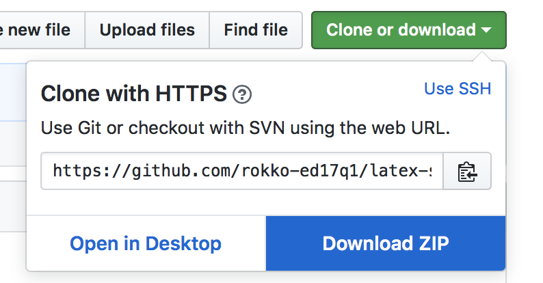
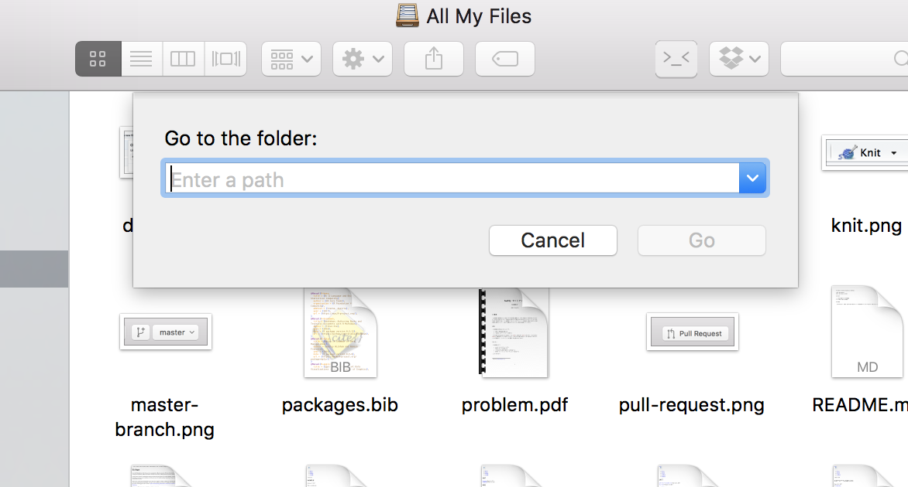

# latex-styles

LaTeX styles necessary for doing homework assignments at the computer lab of Kobe University.

This repository includes copies of

- [`framed`](https://www.ctan.org/pkg/framed) and
- [`filehook`](https://www.ctan.org/pkg/filehook)

## Installation

Move these package directories into `~/Library/texmf/tex/`

It might be more difficult than it sounds because `~/Library` is
typically invisible and there is no `texmf/tex` in that directory by default.

Carefully follow the instructions below:

1. Download the files by clicking "Clone or Download" and then "Download ZIP".  
   
2. In the uncompressed folder `latex-styles`, you should see
   a folder named `texmf`. You will Drag and Drop this directory
   into `~/Library`.
3. Let's go to `~/Library`. Open up a new Finder window. Press
   **Cmd + Shift + G** (Press command, shift and then G without
   releasing the first two). You should see a dialog similar to
   the below picture.
     
4. Type "~/Library" and click "Go".
5. Now that you see the destination folder, Drag and Drop the
   `texmf` directory.
